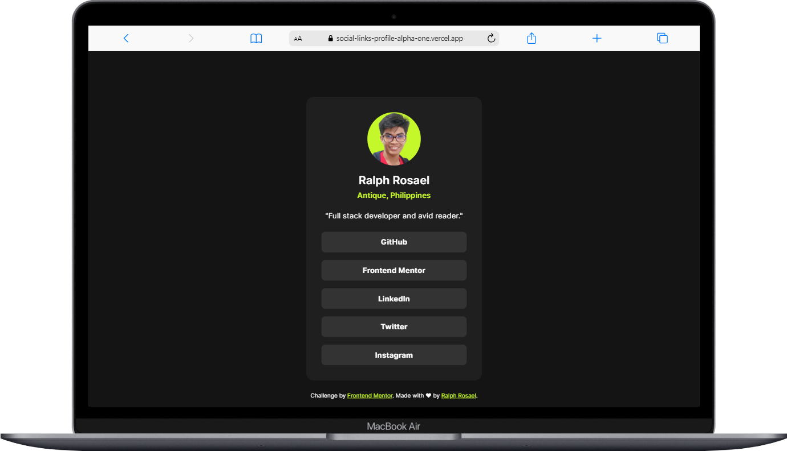
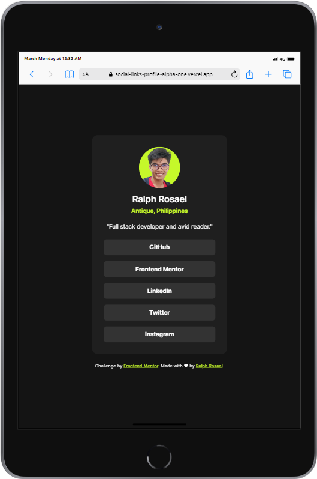
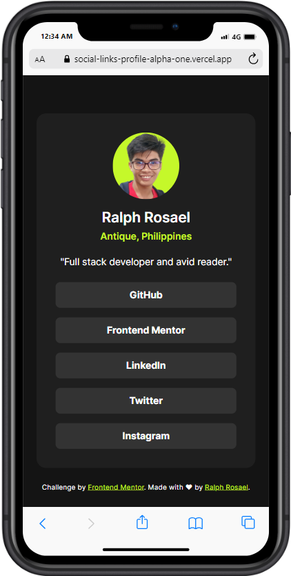

# Frontend Mentor - Social links profile

This is a solution to the [Social links profile challenge on Frontend Mentor](https://www.frontendmentor.io/challenges/social-links-profile-UG32l9m6dQ). [Frontend Mentor](https://www.frontendmentor.io) challenges help you improve your coding skills by building realistic projects.

## Table of contents

- [Overview](#overview)
  - [The challenge](#the-challenge)
  - [Screenshot](#screenshot)
- [Deployment](#deployment)
  - [Links](#links)
- [My process](#my-process)
  - [Built with](#built-with)
  - [Host used](#host-used)
- [Author](#author)

## Overview

### The challenge

Users should be able to:

- See hover and focus states for all interactive elements on the page

### Screenshot

#### Dekstop View

#### Tablet View

#### Mobile View

## Deployment

### Links

- Solution URL: [GitHub Repository](https://github.com/coder-ralph/Social-links-profile)
- Live Site URL: [Deployed Site](https://social-links-profile-alpha-one.vercel.app/)

## My process

### Built with

- Semantic HTML5 markup
- CSS custom properties
- CSS Grid
- Mobile-first workflow

### Host used

This project is hosted on [Vercel](https://vercel.com/). I chose Vercel for its seamless deployment and hosting capabilities.

## Author

- Frontend Mentor - [@Ralph Rosael](https://www.frontendmentor.io/profile/coder-ralph)
- GitHub - [@Ralph Rosael](https://github.com/coder-ralph)
